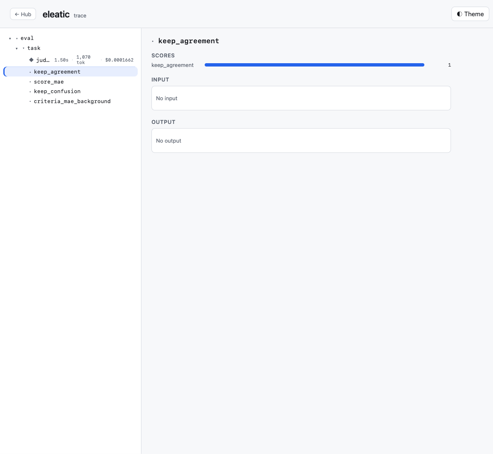

# eleatic

A local-first toolkit for **evaluating and observing LLM systems** — a small family of focused packages, no service to run, no cloud.



## Packages

| Package | What it is |
|---|---|
| **[`@eleatic/eval`](packages/eleatic-eval)** | The eval-results **explorer** + store — compare runs, diff rows, drill into judgments, filter/sort by any facet, watch trends, adjudicate by hand, and walk a trace tree + span inspector, all over a single SQLite file with a framework-free web UI. |

More packages join the family here as they're built (e.g. an `@eleatic/trace` producer SDK that emits the `{ spans }` trace shape `@eleatic/eval` renders). The cross-package contract is the on-disk SQLite schema + the `EvalSpan`/`EvalTrace` types exported from `@eleatic/eval`.

See **[`packages/eleatic-eval`](packages/eleatic-eval)** for install, the API, and a runnable example.

## Develop

```sh
npm install      # installs every workspace
npm run build    # build every package
npm test         # test every package
```

## License

MIT
